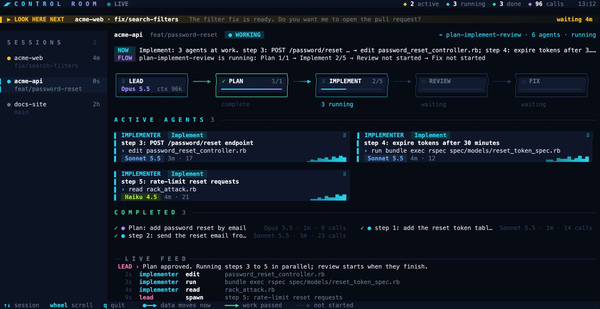

# Control Room

A live view of your Claude Code sessions, sub-agents and workflow runs, in the terminal or in the browser.



*The screenshot uses made-up data.*

## What it shows

- **Look here next**: the session that waits for your reply, and for how long.
- **Sessions**: every Claude Code session from the last 12 hours, with its repository, branch and status.
- **Pipeline**: the lead agent and each workflow phase (Plan, Implement, Review, Fix). A moving particle shows where data flows now.
- **Active agents**: one card for each running sub-agent, with its phase, model, current tool, run time, tool calls and an activity graph.
- **Completed**: the finished sub-agents, with model, run time and tool calls.
- **Live feed**: the last message from the lead and the latest tool calls.

## Requirements

- macOS or Linux, Python 3.9 or later. It uses only the standard library.
- A terminal with 24-bit color, for example Ghostty, iTerm2 or WezTerm.
- Claude Code, which writes the session logs that Control Room reads.

## Install

```sh
git clone https://github.com/tusshar2000/control-room.git ~/.claude/control-room
ln -s ~/.claude/control-room/control-room ~/.local/bin/control-room
```

Make sure that `~/.local/bin` is on your `PATH`.

## Use

| Command | Result |
|---|---|
| `control-room` | Opens the terminal view in the current pane |
| `control-room split` | Opens the terminal view in a new cmux pane on the right |
| `control-room web` | Starts the local server and opens the browser view at http://127.0.0.1:4317 |

Keys in the terminal view:

| Key | Action |
|---|---|
| `↑` / `↓` or `j` / `k` | Select a session |
| Mouse wheel, `PgUp` / `PgDn` | Scroll the agent area |
| `q` | Quit |

## How it works

- `server.py` reads the session logs in `~/.claude/projects`. It reads each file again only when the file changes.
- `tui.py` draws the terminal view with plain ANSI escape codes, about 12 frames each second.
- `index.html` is the browser view. It asks `server.py` for new data every 1.5 seconds.

## Privacy

- Control Room only reads files. It never changes your sessions or logs.
- The browser server accepts connections only from your own machine (`127.0.0.1`).
- No data leaves your machine.

## Limits

- Claude Code logs do not contain final token counts, so Control Room shows tool calls instead.
- "Check this pane" is a guess. A long command and a permission prompt look the same in the logs.
- In a narrow pane, the sidebar hides and the last phases drop off. Make the pane wider to see them.
